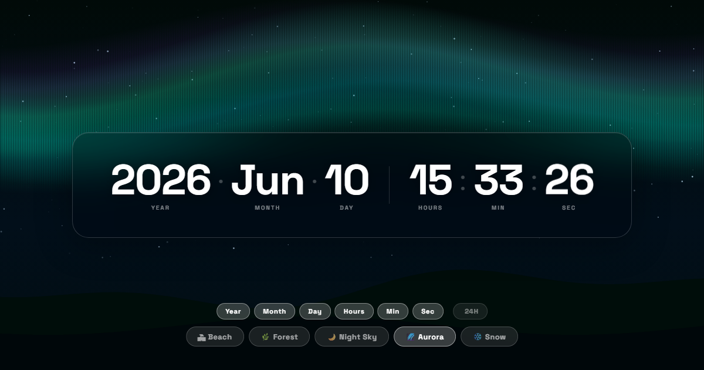

# 🕐 Digital Clock Wallpaper

> Animated wallpaper clock with 5 peaceful scenes. Wallpaper Engine compatible.



🔗 **[View Live →](https://umairjailani.github.io/Digital-Clock/)**

---

## Scenes

| Scene | Description |
|-------|-------------|
| 🏖 Beach | Warm sunset, animated waves, glowing sun |
| 🌿 Forest | Dark pines, falling leaves, light shafts, ground mist |
| 🌙 Night Sky | Twinkling stars, moon, occasional shooting star |
| 🌌 Aurora | Flowing northern lights, star field, horizon silhouette |
| ❄️ Snow | Falling snowflakes, snow-capped pines, moonlight |

## Features

- Toggle each unit on/off: Year · Month · Day · Hours · Min · Sec
- 12h / 24h toggle with AM/PM indicator
- Controls fade out after 3.5s idle — reappear on mouse move
- Preferences saved to localStorage (survive page reload)
- Fullscreen canvas animations — no external assets

## Wallpaper Engine Setup

1. Open Wallpaper Engine → `+` → Browse Files
2. Select `index.html` from this folder
3. Type: **Web**

Requires internet on first load (Google Fonts). Works offline after that.

## Run Locally

```bash
git clone https://github.com/UmairJailani/Digital-Clock.git
cd Digital-Clock
# open index.html in browser or VS Code Live Server
```

---

Made by [Umair Jailani](https://github.com/UmairJailani) · Built with [Claude Code](https://claude.ai/code)
